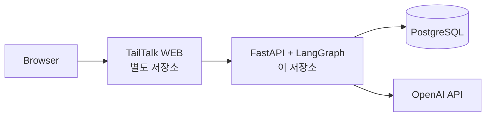
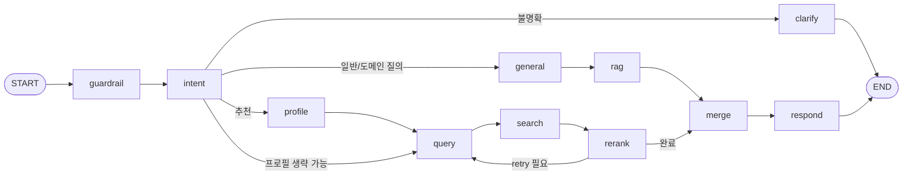
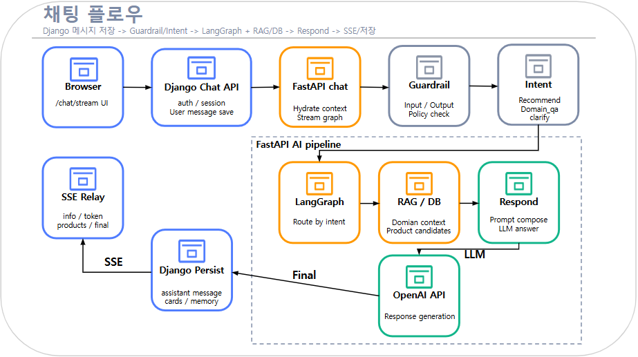
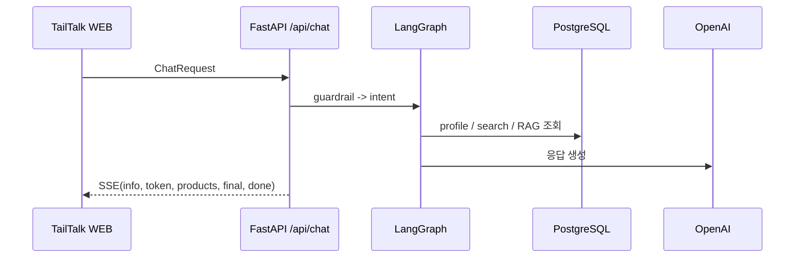

<p align="center">
  
</p>

<h1 align="center">🐾 TailTalk AI</h1>

<p align="center">
  <strong>반려동물 프로필과 대화 문맥을 이해해 상담 응답과 상품 추천을 생성하는 AI 백엔드</strong>
  <br />
  FastAPI, LangGraph, PostgreSQL 기반으로 채팅, 추천, 상품 검색 API를 제공합니다.
</p>

<p align="center">
  
  
  
  
  
</p>

---

## 📌 저장소 역할

이 저장소는 TailTalk에서 AI 전용 백엔드 역할을 담당합니다. 웹 애플리케이션과 분리된 FastAPI 서비스로 동작하며, 사용자 요청을 받아 채팅 응답 생성, 반려동물 맞춤 추천, 상품 검색 결과를 반환합니다.

| 영역 | 설명 | 주요 코드 |
| --- | --- | --- |
| 채팅 API | SSE 기반 스트리밍 응답, 세션 생성, 요청 컨텍스트 처리 | `final_ai/api/routers/chat.py` |
| 추천 API | 반려동물 프로필, 건강 고민, 알러지, 예산을 반영한 상품 추천 | `final_ai/api/routers/recommend.py` |
| 상품 API | 검색어/필터 기반 상품 목록 조회 | `final_ai/api/routers/products.py` |
| LangGraph 파이프라인 | guardrail, intent, profile, query, search, rerank, merge, respond 노드 orchestration | `final_ai/graph/` |
| 검색/추천 로직 | hybrid search, 필터 정규화, fallback retry, rerank | `final_ai/application/recommendation/`, `final_ai/domain/recommendation/` |
| 인프라 연동 | PostgreSQL, OpenAI, FastEmbed, 로깅, 트레이싱 | `final_ai/infrastructure/` |
| 배포 | Docker 이미지 빌드, AWS ECR 업로드, Elastic Beanstalk 배포 | `Dockerfile`, `deploy/eb/test-fastapi/`, `.github/workflows/ci-cd.yml` |

## 🏗️ 시스템 구성

이 저장소는 TailTalk 전체 시스템에서 AI 서비스 컨테이너 역할을 맡습니다. 사용자 요청은 별도 웹 저장소에서 받아 이 API로 전달되고, 이 저장소는 AI 결과만 계산해 반환합니다.

운영 환경에서는 FastAPI를 퍼블릭 엔드포인트로 직접 노출하지 않고, Django 및 내부 네트워크 경로를 통해서만 접근하도록 구성합니다. 아래의 `localhost:8001` 예시는 로컬 개발 및 검증용 직접 호출 예시입니다.



### 🧠 채팅 그래프

채팅 파이프라인은 `final_ai/graph/builder.py` 기준으로 아래 흐름을 따릅니다.



### 💬 채팅 흐름

<p align="center">
  
</p>

채팅 요청은 요청 컨텍스트 보강, 프로필/문맥 조회, 검색 및 rerank, 응답 생성, SSE 스트리밍 순서로 처리됩니다. 최종적으로 `info`, `token`, `products`, `final`, `done`, `error` 이벤트 타입으로 응답이 전달됩니다.

<details>
<summary><strong>Mermaid로 보는 1회 채팅 처리 흐름</strong></summary>



</details>

## 🛠️ 기술 스택

| 구분 | 기술 |
| --- | --- |
| 런타임 | Python 3.11, FastAPI, Uvicorn |
| AI | LangGraph, LangChain, OpenAI |
| 검색 | PostgreSQL, hybrid search, rerank |
| 임베딩 | FastEmbed, `intfloat/multilingual-e5-large` |
| 데이터 처리 | SQLAlchemy, psycopg2, pandas, pyarrow |
| 관측성 | request-id logging, LangSmith |
| 인프라 | Docker, Docker Compose, AWS ECR, AWS Elastic Beanstalk, GitHub Actions |

기본 LLM 모델은 `final_ai/infrastructure/settings.py` 기준 `gpt-4o-mini`입니다.

## 🗂️ 프로젝트 구조

```text
.
|-- main.py                         # Uvicorn 진입점
|-- final_ai/
|   |-- main.py                     # FastAPI app, router 등록, health check
|   |-- api/
|   |   |-- routers/                # chat, recommend, products API
|   |   |-- dependencies/           # request id, user/session header, auth context
|   |   `-- presenters/             # SSE, error response
|   |-- application/
|   |   |-- chat/                   # chat request hydrate, graph invoke, memory payload
|   |   `-- recommendation/         # 추천/상품 목록 application service
|   |-- contracts/                  # request/response contract, filters, SSE payload
|   |-- domain/                     # intent, guardrails, response, recommendation domain logic
|   |-- graph/                      # LangGraph state, node, builder
|   |-- infrastructure/
|   |   |-- db/                     # PostgreSQL connection
|   |   |-- embedding/              # FastEmbed client
|   |   |-- llm/                    # OpenAI client
|   |   |-- observability/          # logging, tracing
|   |   |-- repositories/           # pet/product/chat context query
|   |   `-- search/                 # hybrid search
|   |-- data/                       # 건강 고민 매핑 데이터
|   |-- pipeline/data/              # category metadata
|   `-- harness/                    # chat/recommendation 평가 harness
|-- scripts/
|   `-- prewarm_fastembed.py        # Docker build 시 FastEmbed 모델 캐시 사전 적재
|-- deploy/eb/test-fastapi/
|   |-- docker-compose.yml          # Elastic Beanstalk 배포용 compose
|   `-- .platform/                  # ECR login hook
|-- Dockerfile
|-- requirements.txt
`-- .env.example
```

## 🔌 API 구성

기본 라우터는 `final_ai/main.py`에서 등록됩니다.

> 운영 환경 기준으로 아래 경로들은 FastAPI 내부 서비스 라우트입니다. 실제 사용자 트래픽은 Django를 거쳐 전달되며, FastAPI를 외부에서 직접 호출하는 방식으로 공개하지 않습니다.

| 메서드 | 경로 | 설명 |
| --- | --- | --- |
| `GET` | `/` | 서비스 상태와 health 경로 반환 |
| `GET` | `/health` | health check |
| `POST` | `/api/chat/` | 채팅 SSE 스트리밍 |
| `POST` | `/api/chat/sessions/` | 세션 ID 생성 |
| `POST` | `/api/chat/sessions/{session_id}/messages/` | 특정 세션으로 채팅 스트리밍 |
| `GET` | `/api/chat/sessions/{session_id}/messages/` | 세션 메시지 조회 placeholder |
| `DELETE` | `/api/chat/sessions/{session_id}/` | 세션 삭제 placeholder |
| `GET` | `/api/recommend/` | 추천 상품 조회 |
| `GET` | `/api/products/` | 상품 목록 조회 |

### 🧾 공통 헤더

| 헤더 | 설명 |
| --- | --- |
| `X-Request-Id` | 없으면 서버에서 UUID 생성 |
| `X-User-Id` | 요청 사용자 식별자 |
| `X-Session-Id` | `thread_id`가 없거나 `default`일 때 보조 세션 ID로 사용 |
| `Authorization: Bearer <token>` | bearer token 추출만 수행하며 현재 라우터에서 강제 검증하지는 않음 |

### ✉️ 채팅 요청 형식

`POST /api/chat/`는 `ChatRequest` 계약을 사용합니다.

| 필드 | 설명 |
| --- | --- |
| `message` | 사용자 입력 |
| `thread_id` | 대화 스레드 ID, 기본값 `default` |
| `user_id` | 사용자 ID |
| `target_pet_id` | 대상 반려동물 ID |
| `pet_profile` | 직접 전달하는 반려동물 프로필 |
| `health_concerns` | 건강 고민 목록 |
| `allergies` | 알러지 목록 |
| `food_preferences` | 식이 선호 목록 |
| `conversation_history` | 이전 대화 히스토리 |
| `summary_candidates` | memory compact 후보 메시지 |
| `memory_summary` | 누적 memory summary |
| `dialog_state` | 호출 측에서 유지하는 추가 상태 |

예시:

```bash
curl -N -X POST http://localhost:8001/api/chat/ \
  -H "Content-Type: application/json" \
  -H "X-User-Id: 1" \
  -d '{
    "message": "눈물 자국이 있는 고양이에게 맞는 사료 추천해줘",
    "thread_id": "default",
    "target_pet_id": "1",
    "health_concerns": ["눈물"],
    "allergies": ["닭고기"]
  }'
```

위 예시는 로컬 개발 환경에서 FastAPI를 직접 띄운 경우의 호출 예시입니다. 운영 환경에서는 Django가 이 요청을 내부적으로 FastAPI에 전달합니다.

### 🎯 추천 API

`GET /api/recommend/`

| 파라미터 | 설명 |
| --- | --- |
| `query` | 필수 추천 질의 |
| `user_id` | 사용자 ID |
| `target_pet_id` | 대상 반려동물 ID |
| `pet_type` | 반려동물 종류 |
| `breed` | 품종 |
| `age` | 연령 정보 |
| `category` | 상품 카테고리 |
| `subcategory` | 상품 하위 카테고리 |
| `brand` | 브랜드 |
| `health_concerns` | 반복 가능한 건강 고민 파라미터 |
| `allergies` | 반복 가능한 알러지 파라미터 |
| `food_preferences` | 반복 가능한 식이 선호 파라미터 |
| `budget` | 예산 상한 |
| `limit` | 1-20, 기본값 5 |

예시:

```bash
curl "http://localhost:8001/api/recommend/?query=장건강%20사료&pet_type=dog&budget=30000&limit=5"
```

이 예시 역시 로컬 개발 또는 비공개 네트워크 검증 기준입니다. 운영 환경에서는 Django 또는 내부 호출 계층을 통해 접근합니다.

### 🛍️ 상품 API

`GET /api/products/`

| 파라미터 | 설명 |
| --- | --- |
| `query` | 검색어. 없으면 필터 기반 목록 조회 |
| `pet_type` | 반려동물 종류 |
| `category` | 상품 카테고리 |
| `subcategory` | 상품 하위 카테고리 |
| `brand` | 브랜드 |
| `budget` | 예산 상한 |
| `include_soldout` | 품절 포함 여부 |
| `limit` | 1-100, 기본값 20 |
| `offset` | 기본값 0 |

예시:

```bash
curl "http://localhost:8001/api/products/?query=간식&pet_type=cat&limit=20&offset=0"
```

운영 환경에서 상품 조회 역시 FastAPI 공개 주소를 직접 호출하는 형태가 아니라, 상위 서비스 레이어를 통해 사용합니다.

## ⚙️ 환경 변수

`.env.example`에는 로컬 실행에 필요한 최소 값만 포함되어 있고, 배포용 compose와 workflow에서는 아래 확장 환경변수도 함께 지원합니다.

| 변수 | 기본값 | 설명 |
| --- | --- | --- |
| `POSTGRES_HOST` | `localhost` | PostgreSQL host |
| `POSTGRES_PORT` | `5432` | PostgreSQL port |
| `POSTGRES_DB` | `tailtalk_db` | 데이터베이스 이름 |
| `POSTGRES_USER` | `mungnyang` | 데이터베이스 사용자 |
| `POSTGRES_PASSWORD` | 없음 | 데이터베이스 비밀번호 |
| `OPENAI_API_KEY` | 없음 | OpenAI API 키 |
| `OPENAI_TIMEOUT_SECONDS` | `20` | OpenAI 요청 timeout |
| `POSTGRES_CONNECT_TIMEOUT_SECONDS` | `5` | DB 연결 timeout |
| `POSTGRES_STATEMENT_TIMEOUT_MS` | `20000` | SQL statement timeout |
| `FASTEMBED_MODEL` | `intfloat/multilingual-e5-large` | 임베딩 모델 |
| `FASTEMBED_CACHE_PATH` | `/opt/fastembed-cache` | FastEmbed 캐시 경로 |
| `FASTEMBED_LOCAL_FILES_ONLY` | 배포 기본 `true` | 로컬 캐시만 사용할지 여부 |
| `FASTEMBED_AUTO_DISABLE_LOW_MEMORY` | 배포 기본 `true` | 저메모리 환경 자동 완화 옵션 |
| `LANGSMITH_TRACING` | `false` | LangSmith tracing 활성화 |
| `LANGSMITH_API_KEY` | 없음 | LangSmith API 키 |
| `LANGSMITH_PROJECT` | `tailtalk-fastapi-local` | LangSmith 프로젝트명 |
| `LANGSMITH_ENDPOINT` | `https://api.smith.langchain.com` | LangSmith endpoint |
| `LANGSMITH_WORKSPACE_ID` | 없음 | LangSmith workspace ID |
| `INTERNAL_SERVICE_TOKEN` | 없음 | 내부 서비스 연동용 토큰 |
| `FASTAPI_UVICORN_WORKERS` | `1` | 배포 컨테이너 worker 수 |

## 💻 로컬 실행

이 섹션은 개발자가 로컬에서 FastAPI를 직접 실행하고 검증하기 위한 절차입니다. 운영 환경 접근 방식과는 다릅니다.

### 1. 📦 의존성 설치

```bash
python -m venv .venv
source .venv/bin/activate
python -m pip install -r requirements.txt
```

Windows PowerShell:

```powershell
python -m venv .venv
.\.venv\Scripts\Activate.ps1
python -m pip install -r requirements.txt
```

### 2. 🔐 환경 변수 설정

```bash
cp .env.example .env
```

PowerShell:

```powershell
Copy-Item .env.example .env
```

최소 예시:

```env
POSTGRES_HOST=localhost
POSTGRES_PORT=5432
POSTGRES_DB=tailtalk_db
POSTGRES_USER=mungnyang
POSTGRES_PASSWORD=
OPENAI_API_KEY=
```

### 3. ▶️ 서버 실행

```bash
uvicorn main:app --reload --host 0.0.0.0 --port 8001
```

확인:

```bash
curl http://localhost:8001/health
```

정상 응답:

```json
{"status":"ok"}
```

## 🐳 도커 실행

이미지 빌드:

```bash
docker build -t tailtalk-fastapi .
```

FastEmbed prewarm을 끄고 빌드:

```bash
docker build --build-arg PREWARM_FASTEMBED=0 -t tailtalk-fastapi .
```

컨테이너 실행:

```bash
docker run --rm -p 8001:8001 --env-file .env tailtalk-fastapi
```

기본 실행 명령:

```bash
uvicorn main:app --host 0.0.0.0 --port 8001 --workers 1
```

## 🚀 배포

### ⚡ GitHub Actions

이 저장소의 배포 파이프라인은 `.github/workflows/ci-cd.yml`에 정의되어 있습니다.

| 항목 | 값 |
| --- | --- |
| 브랜치 | `develop` |
| AWS 리전 | `ap-northeast-2` |
| ECR 저장소 | `027099020675.dkr.ecr.ap-northeast-2.amazonaws.com/test-tailtalk-fastapi` |
| Elastic Beanstalk 앱 | `test-tailtalk-fastapi` |
| Elastic Beanstalk 환경 | `test-tailtalk-fastapi-env` |
| Internal Target Group | `tailtalk-fastapi-int-tg` |
| 컨테이너 포트 | `8001` |
| EB 컨테이너 매핑 포트 | `80:8001` |
| 헬스 체크 | `/health` |

여기서 포트 매핑은 배포 컨테이너 내부 구성을 설명하는 값이며, 운영 환경에서 FastAPI를 퍼블릭 API로 직접 개방한다는 의미는 아닙니다.

PR과 push 시 주요 동작:

| 트리거 | 동작 |
| --- | --- |
| `develop` 대상 PR | Docker build, compileall, app import, FastEmbed prewarm smoke test, `/health` smoke test, EB compose 검증 |
| `develop` push | EB 환경변수 반영, ECR push, 배포 번들 생성, Elastic Beanstalk 배포, internal target group 재연결 및 health 대기 |

### 📦 Elastic Beanstalk 번들

배포 번들은 `deploy/eb/test-fastapi/docker-compose.yml`을 기반으로 생성됩니다. compose 파일의 `__FASTAPI_IMAGE__` placeholder는 CI/CD에서 실제 ECR 이미지 태그로 치환됩니다.

또한 `.platform/hooks/prebuild/01_ecr_login.sh`와 `.platform/confighooks/prebuild/01_ecr_login.sh`를 통해 Private ECR 로그인 훅이 실행됩니다.

### 🔔 웹 저장소 동기화 알림

`develop` 브랜치 push 후 `.github/workflows/notify-web-repo.yml`이 별도 WEB 저장소에 repository dispatch를 전송합니다. 목적은 WEB 저장소가 이 FastAPI 저장소 변경을 감지하고 submodule 동기화 작업을 이어서 수행하도록 만드는 것입니다.

## ✅ 검증

문서에 적힌 CI 검증 명령은 아래와 같습니다.

```bash
python -m compileall main.py final_ai
python -c "from main import app; print(app.title)"
python -c "from fastapi.testclient import TestClient; import main; client = TestClient(main.app); resp = client.get('/health'); assert resp.status_code == 200, resp.text"
```

Docker 기반 검증 예시:

```bash
docker build -t tailtalk-fastapi:ci .
docker run --rm tailtalk-fastapi:ci python -m compileall main.py final_ai
docker run --rm tailtalk-fastapi:ci python -c "from main import app; print(app.title)"
```
## 📄 License

MIT 라이선스 하에 배포됩니다. 자세한 내용은 [LICENSE](LICENSE)를 참고하세요.

## 👥 팀 소개

<p align="center" style="font-size: 24px;">
  <strong>SKN22 Final Project · Team 2</strong>
</p>

<!-- 팀원 사진은 .github/assets/readme/team/ 경로에 아래 파일명으로 추가하면 README에 표시됩니다. -->
<table align="center" cellpadding="8" cellspacing="0">
  <tr>
    <td align="center" width="25%">
      
    </td>
    <td align="center" width="25%">
      
    </td>
    <td align="center" width="25%">
      
    </td>
    <td align="center" width="25%">
      
    </td>
  </tr>
  <tr>
    <td align="center"><strong>이준서</strong></td>
    <td align="center"><strong>황하령</strong></td>
    <td align="center"><strong>김희준</strong></td>
    <td align="center"><strong>이신재</strong></td>
  </tr>
  <tr>
    <td align="center" bgcolor="#4F46E5"><strong>PM / AI</strong></td>
    <td align="center" bgcolor="#4F46E5"><strong>Frontend / Backend</strong></td>
    <td align="center" bgcolor="#4F46E5"><strong>Backend / Infra / DevOps</strong></td>
    <td align="center" bgcolor="#4F46E5"><strong>Data / QA</strong></td>
  </tr>
  <tr>
    <td valign="top">
      <ul>
        <li>AI 추천 로직 및 LangGraph 파이프라인 고도화 담당</li>
        <li>의도 분류, 상태 관리, clarity 분기 로직 개선 담당</li>
        <li>PostgreSQL/pgvector 기반 하이브리드 검색 및 RRF 랭킹 구현 담당</li>
        <li>추천 엔진 정교화</li>
      </ul>
    </td>
    <td valign="top">
      <ul>
        <li>서비스 프론트엔드 및 UX 설계 담당</li>
        <li>채팅, 프로필, 반려동물, 카탈로그, 주문 화면 구현 담당</li>
        <li>추천형 채팅 UX 및 커머스 사용자 플로우 개선 담당</li>
        <li>관리자 화면 MVP 및 운영 UX 구성 담당</li>
      </ul>
    </td>
    <td valign="top">
      <ul>
        <li>백엔드 아키텍처 및 Django/FastAPI 통합 담당</li>
        <li>OAuth 인증 기능 구현</li>
        <li>데이터 모델링 및 PostgreSQL/pgvector 스키마 관리</li>
        <li>AWS 인프라, Docker 컨테이너, CI/CD 구축 및 운영 안정화</li>
      </ul>
    </td>
    <td valign="top">
      <ul>
        <li>Playwright 크롤링, 파이프라인 구축</li>
        <li>프로젝트 기반 시장 조사</li>
        <li>LLM 활용 데이터 정제</li>
        <li>LangGraph 파이프라인 점검</li>
        <li>하네스 응답 품질 검증 담당</li>
      </ul>
    </td>
  </tr>
  <tr>
    <td align="center">
      <a href="https://github.com/Leejunseo84">
        
      </a>
    </td>
    <td align="center">
      <a href="https://github.com/harry1749">
        
      </a>
    </td>
    <td align="center">
      <a href="https://github.com/heejoon-91">
        
      </a>
    </td>
    <td align="center">
      <a href="https://github.com/Codingcooker74">
        
      </a>
    </td>
  </tr>
</table>
