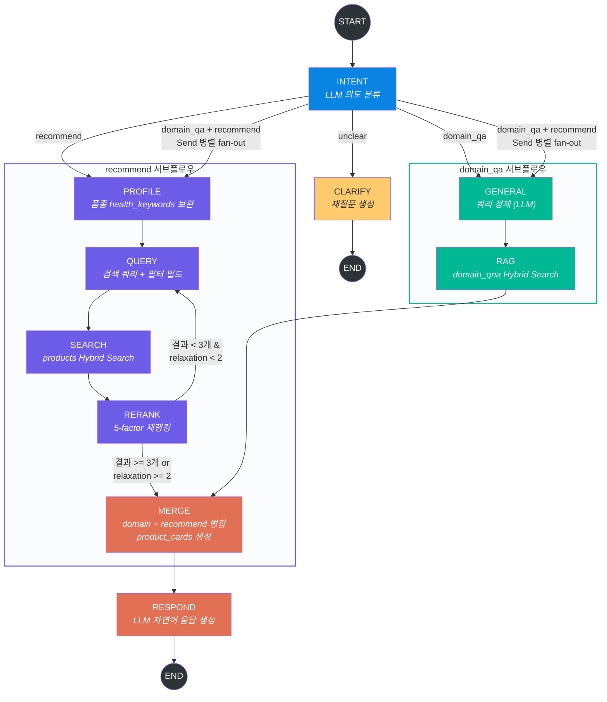

# TailTalk AI - 프로젝트 현황 분석서

> 작성일: 2026-03-23
> 브랜치: develop
> 커밋: c42188c (feat: FastAPI 챗봇 서비스 초기 구성)

---

## 1. 프로젝트 개요

반려동물(강아지/고양이) 상품 추천 + 도메인 QA 챗봇 서비스.
사용자 질문의 의도를 분류하고, 벡터 검색 기반 상품 추천과 전문 지식 RAG를 결합하여 응답을 생성한다.

---

## 2. 기술 스택

| 영역 | 기술 | 버전 |
|------|------|------|
| API 서버 | FastAPI + Uvicorn | 0.135.1 / 0.41.0 |
| LLM | OpenAI GPT-4o-mini | — |
| 대화 그래프 | LangGraph (StateGraph + MemorySaver) | 1.1.2 |
| 벡터 DB | Qdrant (Hybrid Search: Dense + Sparse BM25 + RRF) | client 1.17.1 |
| Dense 임베딩 | intfloat/multilingual-e5-large (1024d) | fastembed 0.4.1 |
| Sparse 임베딩 | Qdrant/bm25 | fastembed 0.4.1 |
| RDB | PostgreSQL (SQLAlchemy + psycopg2) | 2.0.48 |
| 데이터 처리 | pandas + pyarrow | 2.2.3 / 19.0.1 |
| 컨테이너 | Docker (Python 3.11-slim) | — |

---

## 3. 디렉토리 구조

```
SKN22-Final-2Team-AI/
├── main.py                      # FastAPI 앱 엔트리포인트
├── Dockerfile                   # Python 3.11-slim 기반 이미지
├── requirements.txt             # 의존성 목록
├── core/
│   ├── __init__.py
│   └── qdrant_setup.py          # Qdrant 컬렉션 초기화 스크립트
├── pipeline/
│   ├── __init__.py
│   ├── chatbot_graph.py         # LangGraph 그래프 빌드 + 라우팅 로직
│   ├── state.py                 # ChatState (TypedDict) 정의
│   ├── utils.py                 # LLM/Qdrant 클라이언트, Hybrid Search, 헬퍼
│   ├── data/
│   │   └── category.json        # 강아지/고양이 카테고리 체계
│   └── nodes/
│       ├── __init__.py
│       ├── intent.py            # 의도 분류 노드
│       ├── clarify.py           # 재질문 노드
│       ├── domain_qa.py         # 쿼리 정제(general) + RAG 검색(rag) 노드
│       ├── recommend.py         # 프로필 보완 + 쿼리 생성 + 검색 + 재랭킹 노드
│       ├── merge.py             # 결과 병합 노드
│       └── respond.py           # 최종 응답 생성 노드
├── routers/
│   ├── __init__.py
│   ├── chat.py                  # POST /api/chat/ (SSE 스트리밍)
│   ├── recommend.py             # GET /api/recommend/ (TODO)
│   └── products.py              # GET /api/products/ (TODO)
└── schemas/
    └── __init__.py              # (비어 있음)
```

---

## 4. LangGraph 파이프라인 아키텍처

> 소스: `pipeline/chatbot_graph.py`

### 4.1 그래프 정의 (StateGraph)

```python
# 노드 등록 (10개)
g = StateGraph(ChatState)
g.add_node("intent",  intent_node)       # 의도 분류
g.add_node("clarify", clarify_node)      # 재질문
g.add_node("general", general_node)      # 도메인 QA 쿼리 정제
g.add_node("rag",     rag_node)          # 도메인 QA RAG 검색
g.add_node("profile", profile_node)      # 품종 프로필 보완
g.add_node("query",   query_node)        # 상품 검색 쿼리 빌드
g.add_node("search",  search_node)       # 상품 Hybrid Search
g.add_node("rerank",  rerank_node)       # 상품 재랭킹
g.add_node("merge",   merge_node)        # 결과 병합
g.add_node("respond", respond_node)      # 최종 응답 생성
```

### 4.2 엣지 구성

```python
# 진입점
START ──► intent

# 조건부 분기: route_intent()
intent ──conditional──► clarify | general | profile | [Send 병렬]

# 종료
clarify ──► END

# domain_qa 서브플로우 (순차)
general ──► rag ──► merge

# recommend 서브플로우 (순차 + 조건부 루프)
profile ──► query ──► search ──► rerank ──conditional──► query (재시도) | merge

# 공통 출구
merge ──► respond ──► END
```

### 4.3 플로우 다이어그램



### 4.4 라우팅 함수

**route_intent(state)** — INTENT 이후 분기
| 조건 | 반환값 | 다음 노드 |
|------|--------|-----------|
| `"unclear" in intents` | `"clarify"` | CLARIFY → END |
| `domain_qa only` | `"general"` | GENERAL → RAG → MERGE |
| `recommend only` | `"profile"` | PROFILE → QUERY → SEARCH → RERANK |
| `domain_qa + recommend` | `[Send("general", state), Send("profile", state)]` | 병렬 fan-out |
| 그 외 (fallback) | `"clarify"` | CLARIFY → END |

**route_rerank(state)** — RERANK 이후 분기
| 조건 | 반환값 | 다음 노드 |
|------|--------|-----------|
| `len(results) < 3 and relaxation < 2` | `"query"` | QUERY 재시도 (필터 완화) |
| 그 외 | `"merge"` | MERGE → RESPOND → END |

### 4.5 노드별 상세

| 노드 | 역할 | 핵심 로직 |
|------|------|-----------|
| **intent** | 의도 분류 | LLM JSON 응답으로 intents, domain_intent, pet_type, category, subcategory, budget 추출 |
| **clarify** | 재질문 생성 | 펫 종류/카테고리 누락 시 사용자에게 재질문, clarification_count 관리 |
| **general** | 쿼리 정제 | 펫 프로필 반영하여 검색 최적화된 쿼리로 LLM 재작성 |
| **rag** | 도메인 RAG | domain_qna 컬렉션 Hybrid Search (species + category 필터), top_k=5 |
| **profile** | 프로필 보완 | breed_meta 컬렉션에서 품종별 health_keywords 조회, health_concerns 병합 |
| **query** | 검색 쿼리 빌드 | LLM으로 검색어 생성 + Qdrant 필터 빌드 (pet_type, category, subcategory, 예산, 알레르기 제외) |
| **search** | 상품 검색 | products 컬렉션 Hybrid Search (top_k=20) + 알레르기 OCR post-filter |
| **rerank** | 재랭킹 | 5가지 가중치 스코어링 (RRF 0.50 / 인기도 0.25 / 감정 0.15 / 재구매 0.10 / ABSA 0.10), 결과 부족 시 필터 완화 루프 (최대 1회) |
| **merge** | 결과 병합 | domain_contexts + reranked_results 합산, product_cards 생성 |
| **respond** | 응답 생성 | 도메인 지식 + 추천 상품을 조합하여 LLM으로 자연어 응답 생성 (3~5문장) |

---

## 5. API 엔드포인트

| 메서드 | 경로 | 상태 | 설명 |
|--------|------|------|------|
| GET | `/health` | 완료 | 헬스체크 |
| POST | `/api/chat/` | 완료 | SSE 스트리밍 챗봇 (token → products → done) |
| GET | `/api/recommend/` | TODO | Qdrant Hybrid Search 직접 연결 (미구현) |
| GET | `/api/products/` | TODO | PostgreSQL 상품 조회 (미구현) |

### Chat API 요청/응답 형식

**Request (POST /api/chat/)**
```json
{
  "message": "눈물 자국 심한 포메 사료 추천해줘",
  "thread_id": "user-123",
  "pet_profile": { "species": "dog", "breed": "포메라니안", "age": 3 },
  "health_concerns": ["눈물"],
  "allergies": ["닭고기"],
  "food_preferences": []
}
```

**Response (SSE stream)**
```
data: {"type": "token", "content": "눈물"}
data: {"type": "token", "content": " 자국이"}
...
data: {"type": "products", "cards": [{"goods_id": ..., "product_name": ..., ...}]}
data: {"type": "done"}
```

---

## 6. Qdrant 컬렉션

| 컬렉션 | 용도 | Dense 차원 | 비고 |
|--------|------|-----------|------|
| products | 상품 Hybrid Search | 1024 | pet_type, category, subcategory, price, sold_out, main_ingredients 필터 |
| domain_qna | 반려동물 도메인 QnA RAG | 1024 | species, category 필터 |
| breed_meta | 품종별 수의 영양학 메타 | 1024 | pet_type 필터, health_keywords 반환 |

---

## 7. 카테고리 체계

### 강아지 (5개 대분류)
- **사료** (22개): 생애주기, 제형, 기능별 (눈/눈물, 체중조절, 피부/모질 등)
- **간식** (13개): 껌, 져키, 수제간식, 음료 등
- **용품** (11개): 미용, 산책, 장난감, 리빙 등
- **배변용품** (7개): 패드, 기저귀, 탈취제 등
- **덴탈관** (5개): 수의사인증, 칫솔, 치약 등

### 고양이 (5개 대분류)
- **사료** (19개): 생애주기, 제형, 기능별 (헤어볼, 요로기계 등)
- **간식** (10개): 캔, 파우치, 동결건조 등
- **용품** (12개): 캣타워, 스크래쳐, 화장실 등
- **모래** (4개): 두부모래, 벤토나이트 등
- **습식관** (2개): 주식캔, 주식파우치

---

## 8. 구현 완료 항목

- [x] FastAPI 서버 기본 구조 (CORS, 라우터 분리)
- [x] LangGraph 대화 파이프라인 전체 플로우
- [x] 의도 분류 (recommend / domain_qa / unclear / 복합)
- [x] 병렬 fan-out (domain_qa + recommend 동시 처리)
- [x] Qdrant Hybrid Search (Dense + Sparse + RRF Fusion)
- [x] 재랭킹 알고리즘 (5가지 가중치 + Fallback A/B/C/D)
- [x] 필터 완화 루프 (결과 부족 시 subcategory 제거 후 재검색)
- [x] 알레르기 필터링 (Qdrant must_not + OCR post-filter)
- [x] 예산 범위 필터
- [x] 품종별 건강 키워드 자동 보완 (breed_meta)
- [x] SSE 스트리밍 응답 (단어 단위 + 상품 카드)
- [x] MemorySaver 기반 대화 히스토리 유지
- [x] Qdrant 컬렉션 초기화 스크립트
- [x] 강아지/고양이 카테고리 체계 정의
- [x] Docker 이미지 빌드 설정

---

## 9. 미구현 항목

| 우선순위 | 항목 | 설명 |
|---------|------|------|
| **높음** | 데이터 적재 스크립트 | Qdrant 컬렉션에 실제 상품/QnA/품종 데이터를 적재하는 스크립트 없음 |
| **높음** | 환경변수 설정 | `.env` 파일 없음 (OPENAI_API_KEY, QDRANT_HOST 등) |
| **높음** | docker-compose | Qdrant + PostgreSQL + App 오케스트레이션 구성 없음 |
| **중간** | GET /api/products/ | PostgreSQL 상품 목록 조회 API (미구현) |
| **중간** | GET /api/recommend/ | Qdrant 직접 추천 API (미구현) |
| **중간** | Pydantic 스키마 | `schemas/` 모듈 비어 있음 (응답 모델 미정의) |
| **중간** | 프론트엔드 | SSE 클라이언트 UI 없음 |
| **낮음** | 테스트 코드 | 유닛/통합 테스트 없음 |
| **낮음** | 로깅 | print문 기반 → 구조화된 로깅 전환 필요 |
| **낮음** | 에러 핸들링 | 글로벌 예외 처리, 재시도 로직 없음 |

---

## 10. 평가

### 강점
- LangGraph 파이프라인 설계가 체계적이며, 의도별 분기 + 병렬 처리 + 재랭킹 루프까지 고급 패턴 적용
- Hybrid Search (Dense + Sparse + RRF)로 검색 품질 확보
- 알레르기/예산/품종 기반 개인화 필터링이 세밀하게 구현됨
- 재랭킹에 인기도, 감정분석, 재구매율, ABSA까지 고려한 다차원 스코어링

### 개선 필요
- 데이터 적재 파이프라인이 없어 실제 동작 불가
- 인프라 구성(docker-compose, 환경변수)이 빠져 있어 로컬 실행 불가
- 프론트엔드 없이 API만 존재하여 데모 불가
- `routers/recommend.py`, `routers/products.py`가 TODO 상태
